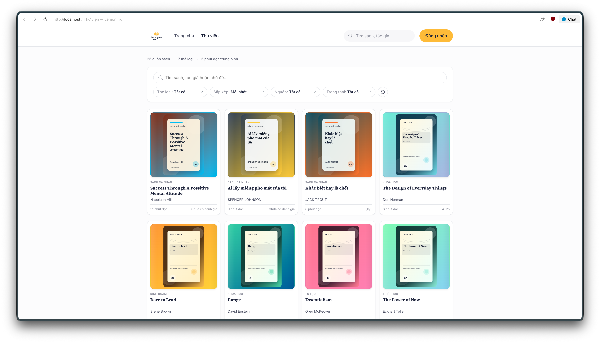
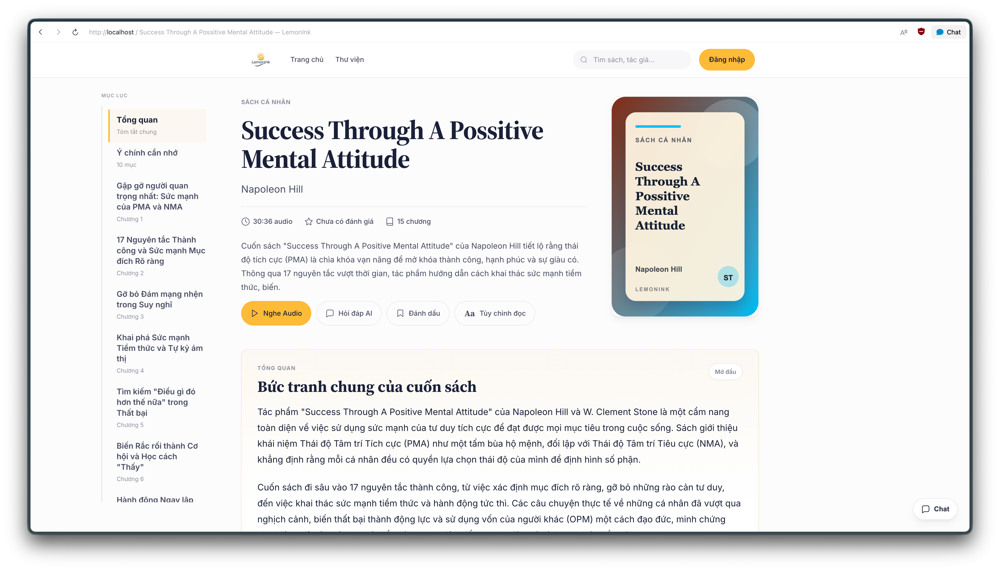
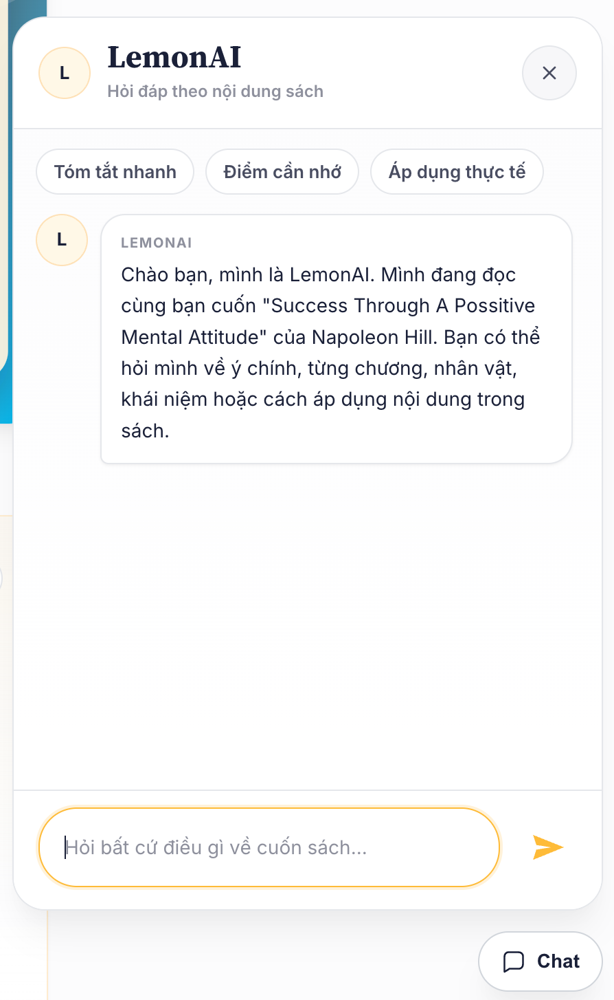
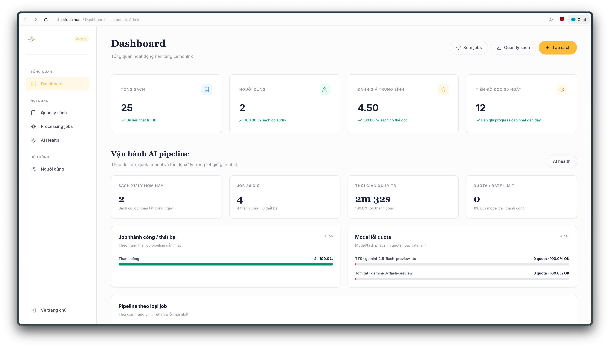
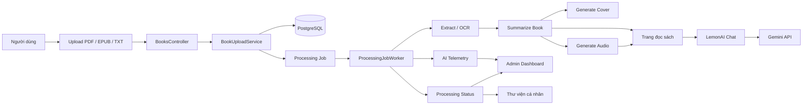

# LemonInk

LemonInk là nền tảng đọc sách ứng dụng AI, giúp biến sách hoặc tài liệu do người dùng tải lên thành bản tóm tắt có cấu trúc, audio nghe nhanh và trải nghiệm hỏi đáp theo nội dung từng cuốn sách.

Ý tưởng cốt lõi của LemonInk là: người dùng tải sách lên, hệ thống trích xuất nội dung, tạo tóm tắt, tạo audio, sau đó người dùng có thể đọc, nghe, đánh dấu, theo dõi tiến độ và hỏi LemonAI về chính cuốn sách đó.

## Tính năng nổi bật

- Tải sách cá nhân với các định dạng PDF, EPUB và TXT.
- Trích xuất nội dung từ tài liệu, có hỗ trợ OCR cho PDF dạng ảnh.
- Tạo tóm tắt bằng AI gồm giới thiệu nhanh, tổng quan, ý chính và nội dung theo chương.
- Tạo audio tóm tắt sách bằng Gemini TTS.
- LemonAI hỗ trợ hỏi đáp theo nội dung từng cuốn sách.
- Tự tạo bìa sách cho các tài liệu người dùng upload.
- Trang đọc sách có mục lục, audio player, đánh dấu, tùy chỉnh đọc và chat AI.
- Thư viện cá nhân có realtime trạng thái xử lý, phần trăm tiến độ và thời gian dự kiến.
- Admin dashboard để theo dõi sách, người dùng, job xử lý, AI health và telemetry model.
- Đăng nhập bằng email/mật khẩu, OTP qua email, Google OAuth, quên mật khẩu và audit bảo mật.

## Ảnh demo

### Trang chủ


### Thư viện



### Trang đọc



### LemonAI



### Admin dashboard



## Kiến trúc tổng quan



## Luồng xử lý sách

1. Người dùng tải lên một file PDF, EPUB hoặc TXT.
2. LemonInk lưu file gốc và tạo một processing job.
3. Background worker bắt đầu trích xuất nội dung từ file.
4. Nếu PDF là dạng ảnh, hệ thống dùng OCR để lấy nội dung chữ.
5. AI tạo giới thiệu nhanh, tổng quan, ý chính và các chương.
6. LemonInk tạo bìa sách dựa trên metadata và nội dung sách.
7. Hệ thống dựng script audio rồi tạo audio theo từng chunk.
8. Trang đọc sách có thể mở trước, trong khi trạng thái audio tiếp tục được cập nhật realtime.
9. LemonAI dùng nội dung đã xử lý để trả lời câu hỏi về cuốn sách hiện tại.

## Công nghệ sử dụng

- **Backend:** ASP.NET Core MVC
- **Giao diện:** Razor Views, CSS, JavaScript thuần
- **Database:** PostgreSQL với Entity Framework Core
- **Authentication:** ASP.NET Core Identity, Google OAuth, email OTP, reset mật khẩu
- **AI:** Gemini API cho tóm tắt, chat, OCR hỗ trợ và TTS
- **Background jobs:** Hosted worker service xử lý pipeline sách
- **Email:** SMTP email sender với HTML email templates
- **Realtime UX:** Polling endpoint cho tiến độ xử lý, audio readiness và admin dashboard

## Cấu trúc thư mục

```text
LemonInk/
├── BackgroundJobs/          # Worker xử lý sách nền
├── Controllers/             # MVC controllers cho app, auth, admin và sách
├── Data/                    # DbContext và seed data
├── Entities/                # Database entities
├── Infrastructure/          # Hạ tầng dùng chung và tích hợp bên ngoài
├── Migrations/              # EF Core migrations
├── Services/                # Business logic, AI pipeline, email, auth, upload
├── ViewModels/              # View models cho Razor Views
├── Views/                   # Razor pages
├── wwwroot/                 # Static assets, CSS, JS, uploads
├── docs/                    # Tài liệu kế hoạch và ghi chú dự án
├── Program.cs               # Cấu hình app và dependency injection
└── ZenRead.csproj           # File project ASP.NET Core
```

## Các module chính

### Upload và trích xuất nội dung

`BookUploadService` xử lý upload sách, kiểm tra định dạng và dung lượng file, lưu file gốc và tạo job xử lý. `TextExtractionService` chịu trách nhiệm trích xuất nội dung từ PDF, EPUB, TXT và hỗ trợ OCR cho tài liệu scan.

### AI pipeline

AI pipeline được điều phối bởi `ProcessingJobService` và chạy nền qua `ProcessingJobWorker`. Pipeline đưa sách đi qua các bước: trích xuất nội dung, tóm tắt, tạo bìa, tạo audio và cập nhật trạng thái xử lý.

### Tạo audio

`GeminiAudioGenerationService` tạo audio từ script có cấu trúc. Script audio bao gồm tên sách, tác giả, tổng quan và nội dung các chương để audio khớp với bản tóm tắt hơn.

### LemonAI Chat

`GeminiChatService` cung cấp chat LemonAI trong trang đọc. Chat được giới hạn theo cuốn sách hiện tại, giúp người dùng hỏi về ý chính, chương, khái niệm, tác giả hoặc cách áp dụng nội dung sách.

### Admin dashboard

Khu vực admin được thiết kế như một dashboard vận hành. Admin có thể theo dõi người dùng, sách, processing jobs, trạng thái model AI, retry job, tỷ lệ lỗi và telemetry xử lý.

### Authentication và bảo mật

LemonInk dùng ASP.NET Core Identity với email/mật khẩu, Google OAuth, OTP qua email, reset mật khẩu, pending email confirmation, audit đăng nhập, rate limiting và security headers.

## Cài đặt local

### Yêu cầu

- .NET SDK
- PostgreSQL
- Tùy chọn: Google OAuth credentials
- Tùy chọn: Gemini API key
- Tùy chọn: Gmail app password để gửi email SMTP

### Cấu hình secrets

Dùng .NET user secrets cho môi trường local. Không commit API key, OAuth secret, SMTP password hoặc mật khẩu database lên GitHub.

```bash
dotnet user-secrets set "ConnectionStrings:DefaultConnection" "Host=localhost;Port=5432;Database=lemonink;Username=lemonink_user;Password=your-password"
dotnet user-secrets set "AI:Gemini:ApiKey" "your-gemini-api-key"
dotnet user-secrets set "Audio:Gemini:ApiKey" "your-gemini-api-key"
```

Google OAuth:

```bash
dotnet user-secrets set "Authentication:OAuth:Google:ClientId" "your-google-client-id"
dotnet user-secrets set "Authentication:OAuth:Google:ClientSecret" "your-google-client-secret"
```

SMTP email:

```bash
dotnet user-secrets set "Email:Smtp:Host" "smtp.gmail.com"
dotnet user-secrets set "Email:Smtp:Port" "587"
dotnet user-secrets set "Email:Smtp:Username" "your-notification-email@gmail.com"
dotnet user-secrets set "Email:Smtp:Password" "your-gmail-app-password"
dotnet user-secrets set "Email:Smtp:FromEmail" "your-notification-email@gmail.com"
dotnet user-secrets set "Email:Smtp:FromName" "LemonInk"
```

Tùy chọn tạo admin local:

```bash
dotnet user-secrets set "SeedAdmin:Email" "admin@lemonink.local"
dotnet user-secrets set "SeedAdmin:Password" "change-this-local-password"
dotnet user-secrets set "SeedAdmin:FullName" "LemonInk Admin"
```

### Chạy dự án

```bash
dotnet restore
dotnet ef database update
dotnet run
```

Ứng dụng chạy tại:

```text
http://localhost:3000
```

### Tài khoản demo

Nếu muốn tạo tài khoản demo để thử admin dashboard ở local, bật `SeedDemoAdmin` bằng user secrets hoặc `appsettings.Development.json` local, không commit file local này lên GitHub:

```bash
dotnet user-secrets set "SeedDemoAdmin:Enabled" "true"
dotnet user-secrets set "SeedDemoAdmin:Email" "demo.admin@lemonink.local"
dotnet user-secrets set "SeedDemoAdmin:Password" "LemonInkDemo@2026!"
dotnet user-secrets set "SeedDemoAdmin:FullName" "LemonInk Demo Admin"
```

Sau khi bật, thông tin đăng nhập demo là:

```text
Email: demo.admin@lemonink.local
Mật khẩu: LemonInkDemo@2026!
```

Tài khoản này chỉ được gán role `Admin`, dùng cho demo local và được điều khiển bằng cấu hình `SeedDemoAdmin:Enabled`. Không dùng tài khoản demo cho môi trường production.

## Ghi chú môi trường

Dự án hiện chạy local ở port `3000`. Tên sản phẩm là LemonInk, nhưng một số phần nội bộ vẫn còn giữ tên project cũ là `ZenRead`.

Trước khi public repository, cần kiểm tra các file sau để đảm bảo không chứa thông tin nhạy cảm:

- `appsettings.json`
- `appsettings.Development.json`
- `.env`
- database dump local
- file log sinh ra trong quá trình chạy
- tài liệu hoặc sách upload thử nghiệm

Nếu API key, OAuth secret hoặc SMTP password từng bị lộ trong quá trình phát triển, nên rotate key trước khi đưa dự án lên GitHub.

## Known limitations

- Chất lượng tóm tắt, chat và audio phụ thuộc vào quota, rate limit và độ ổn định của Gemini API, đặc biệt khi dùng free tier.
- Pipeline xử lý sách dài có thể mất nhiều thời gian vì phải trích xuất nội dung, tóm tắt theo chunk và tạo audio theo từng đoạn.
- Dự án hiện ưu tiên trải nghiệm local/demo; nếu triển khai production nên tách queue, storage và secrets sang hạ tầng riêng.
- Một số file PDF scan chất lượng thấp có thể cần OCR nhiều lần hoặc cần người dùng upload tài liệu rõ hơn.

## Điểm nổi bật kỹ thuật

Một số phần đáng chú ý trong quá trình xây dựng LemonInk:

- Xây dựng ứng dụng ASP.NET Core MVC end-to-end.
- Thiết kế workflow thực tế thay vì chỉ là landing page.
- Xử lý upload file, background job và trạng thái xử lý dài.
- Tích hợp AI cho tóm tắt, chat, OCR và TTS.
- Xây dựng đăng nhập, OTP email, OAuth, audit và bảo mật cơ bản.
- Thiết kế admin dashboard có job monitoring và AI telemetry.
- Thiết kế UI tập trung vào trải nghiệm đọc, nghe và quản lý thư viện cá nhân.

## Roadmap

- Viết automated tests cho authentication, upload, processing jobs và AI pipeline.
- Tách queue xử lý sang Redis, Hangfire hoặc message broker nếu triển khai production.
- Dùng cloud object storage cho file upload và audio được tạo ra.
- Thêm Docker Compose cho PostgreSQL và môi trường local.
- Thêm CI workflow để build, test và kiểm tra migration.
- Mở rộng admin charts cho thời gian xử lý, lỗi quota model và tỷ lệ thành công.
- Thêm báo cáo chất lượng sau khi xử lý sách dài: số trang đọc được, số chunk xử lý, số chương phát hiện, độ phủ tóm tắt và độ phủ audio.
- Viết tài liệu deploy production.

## License

Distributed under the MIT License. See `LICENSE` for more information.
